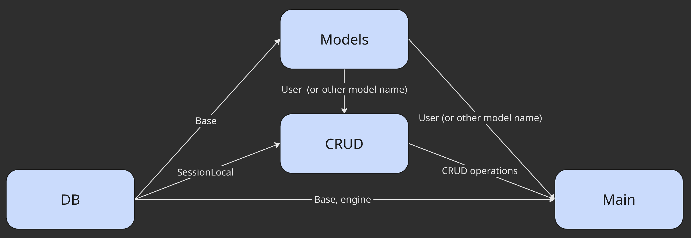

<h1>What is ORM and how it works</h1>
<b>ORM</b> stands for <b>Object-Relational Mapping<b/>
<br>
<br>

|Concept|Description|
|---|---|
|ORM|Maps Python classes to DB tables|
|`engine`|Connects Python to the database|
|`Base`|Parent class for all ORM models|
|`Model`|Python class that represents a table|
|`Session`|Opens a connection to run DB operations|
|`sessionmaker`|Factory for making sessions|
|`Column`|Declares a table column|
|`String`, `Int`|Column types|

<br>


<h2> 📦 Folder structure: </h2> 

```
your_project/
│
├── main.py             ← Runs your app / CRUD tests
├── db.py               ← DB engine, Base, session
├── models.py           ← ORM table classes
├── crud.py             ← CRUD functions
└── schemas.py (optional) ← (Used with FastAPI or Pydantic)
```


<h2> ✅ Summary: Required components </h2>

|File|Purpose|
|---|---|
|`db.py`|Sets up connection (`engine`, `Base`, `SessionLocal`)|
|`models.py`|Defines tables (classes with `Column`)|
|`crud.py`|Has functions to interact with DB|
|`main.py`|Runs everything / imports and calls|
